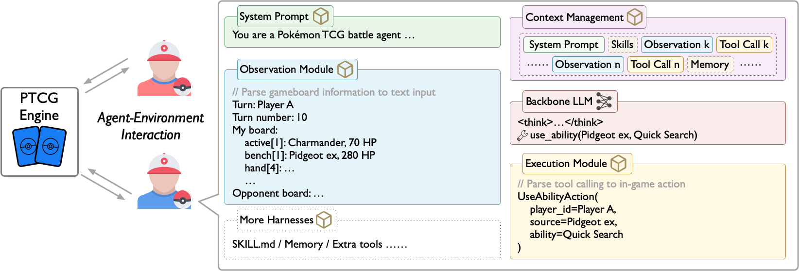
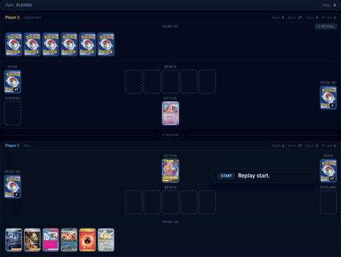
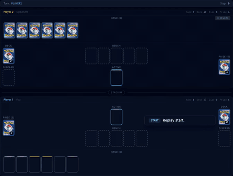
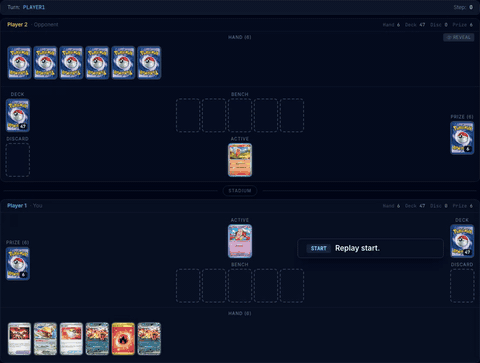
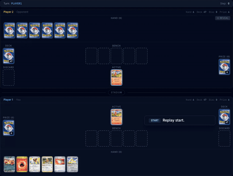
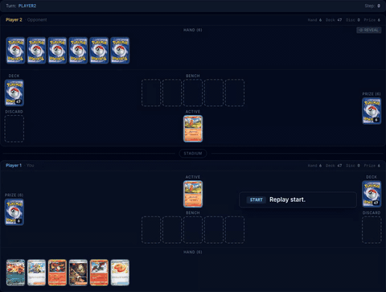
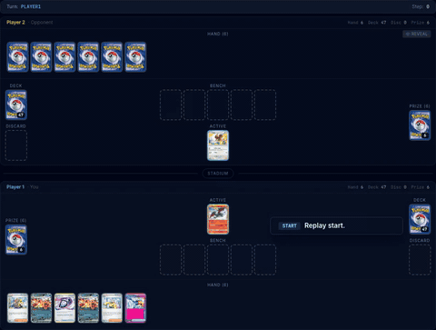

# PTCG-Bench

<p align="center">
  <a href="https://www.python.org/downloads/"></a>
  <a href="https://arxiv.org/abs/2605.29653"></a>
  <a href="https://ddhua.tech/ptcg-bench/"></a>
</p>

<p align="center">
  
</p>

**PTCG-Bench** is a benchmark for evaluating LLM agents in strategically rich, interactive gameplay. Built on the Pokemon Trading Card Game (PTCG), it tests both in-game decision making and improvement through accumulated play experience.

## Gameplay Demo

<table>
  <tr>
    <td width="33%">
      
    </td>
    <td width="33%">
      
    </td>
    <td width="33%">
      
    </td>
  </tr>
  <tr>
    <td width="33%">
      
    </td>
    <td width="33%">
      
    </td>
    <td width="33%">
      
    </td>
  </tr>
</table>

## Installation

PTCG-Bench uses Python 3.12+, [uv](https://docs.astral.sh/uv/), Node.js 18+, npm, and [ptcg-engine](https://github.com/gemelom/ptcg-engine).

```bash
git clone https://github.com/gemelom/PTCG-Bench.git
cd PTCG-Bench

# Install Python dependencies, including ptcg-engine from GitHub.
uv sync

# Install frontend dependencies.
cd frontend
npm ci
cd ..
```

## Backend

Start the FastAPI backend from the repository root:

```bash
uv run python backend/main.py
```

The backend listens on `http://localhost:8000`. API documentation is available at:

- Swagger UI: `http://localhost:8000/docs`
- ReDoc: `http://localhost:8000/redoc`

## Frontend

Start the React/Vite frontend in a second terminal:

```bash
cd frontend
npm run dev
```

The frontend runs at `http://localhost:5173`. During local development, Vite proxies `/api` and `/ws` requests to the backend at `http://localhost:8000`.

To build the frontend for production:

```bash
cd frontend
npm run build
npm run preview
```

## Running Games and Evaluations

Run a single local game:

```bash
uv run python run_game.py \
  --agent1 charizard_heuristic \
  --agent2 random \
  --deck1 charizard_ex \
  --deck2 charizard_ex \
  --seed 0
```

Run a benchmark evaluation:

```bash
uv run python -m ptcgbench.bench.eval_pipeline \
  --agents charizard_heuristic random \
  --n-games 20 \
  --batch-size 5 \
  --deck charizard_ex
```

Other useful evaluation commands:

```bash
# Round-robin among multiple agents.
uv run python -m ptcgbench.bench.eval_pipeline \
  --agents random charizard_heuristic react:deepseek-chat \
  --n-games 30

# Show the global leaderboard, if bench_data/ratings.json exists.
uv run python -m ptcgbench.bench.eval_pipeline --show

# Update global ratings after a run.
uv run python -m ptcgbench.bench.eval_pipeline \
  --agents charizard_heuristic random \
  --n-games 20 \
  --global-ratings
```

Evaluation artifacts are written under `bench_data/runs/<timestamp>_.../`, including run config, checkpoints, metrics, ratings, charts, replay references, and agent skill snapshots when applicable.

## Tests

Run the Python test suite:

```bash
uv run pytest
```

Build and audit the frontend:

```bash
cd frontend
npm run build
npm audit
```

## API Keys

LLM agents use the environment variable for their model provider:

| Provider | Environment variable |
| --- | --- |
| DeepSeek | `DEEPSEEK_API_KEY` |
| OpenRouter | `OPENROUTER_API_KEY` |
| Z.ai | `ZAI_API_KEY` |
| DashScope | `DASHSCOPE_API_KEY` |
| MiniMax | `MINIMAX_API_KEY` |

Weave tracing is initialized during evaluations; configure Weave/W&B credentials only if you want remote trace persistence.

## Data and Cache Files

- `card_data_cache.json` stores card metadata and image URLs used by the backend, frontend card image service, and card-query tools. Refresh it with:

  ```bash
  uv run python scripts/refresh_card_cache.py
  ```

- `bench_data/runs/` is created by benchmark runs and stores per-run artifacts such as `config.json`, `checkpoint.json`, `metrics.json`, `ratings.json`, `rating_history.json`, and `chart.png`.
- `bench_data/ratings.json` is the optional global leaderboard file updated when `--global-ratings` is passed.
- `backend/battle_log/` stores replay logs served by the backend replay endpoints.
- `.ptcg/` and `backend/.ptcg/` are local agent state directories used by evolving agents for battle records, memory, and skills.

Generated run outputs and local agent state are not required to install the project from source.

## Citation

If you use PTCG-Bench or ptcg engine in your work, please cite the arXiv paper:

```bibtex
@misc{hua2026ptcgbenchllmagentsmaster,
      title={PTCG-Bench: Can LLM Agents Master Pok\'emon Trading Card Game?}, 
      author={Dongdong Hua and Yifei Sun and Renhong Huang and Feng Gao and Chunping Wang and Yang Yang},
      year={2026},
      eprint={2605.29653},
      archivePrefix={arXiv},
      primaryClass={cs.AI},
      url={https://arxiv.org/abs/2605.29653}, 
}
```

## License

This project is released under the MIT License. See [LICENSE](LICENSE) for details.

## Trademark Disclaimer

PTCG-Bench is an independent research project and is not affiliated with, endorsed by, sponsored by, or approved by The Pokemon Company, Nintendo, Creatures Inc., or GAME FREAK inc. Pokemon, Pokemon Trading Card Game, and related names, marks, card names, images, and other assets are trademarks or copyrighted materials of their respective owners. This project uses references to Pokemon Trading Card Game concepts solely for research, benchmarking, and interoperability purposes.
